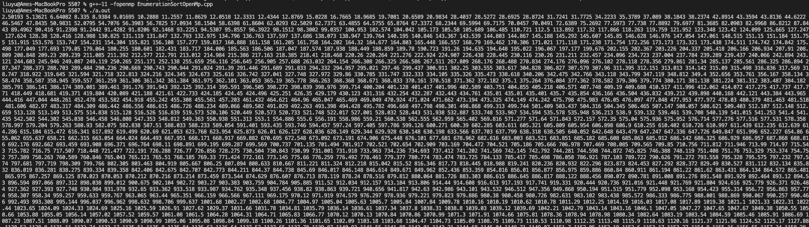
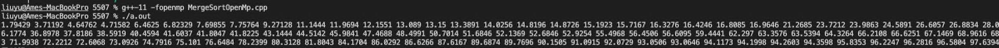
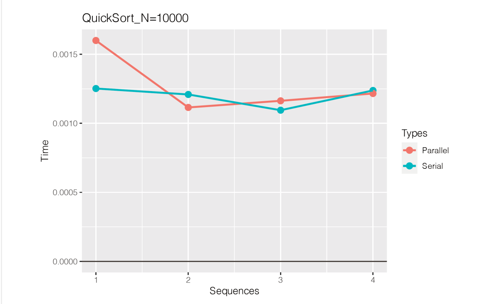
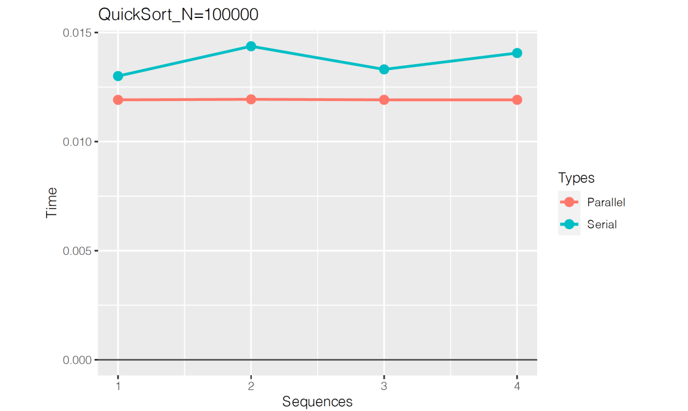
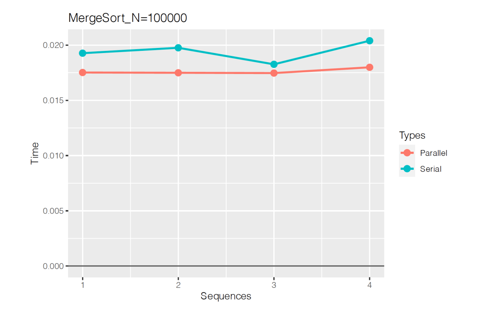
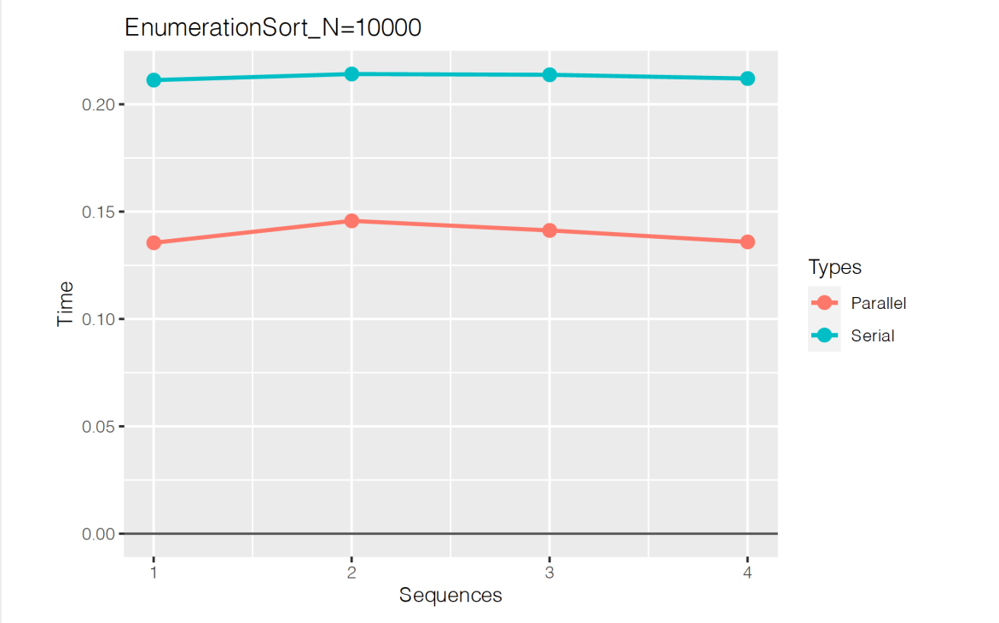
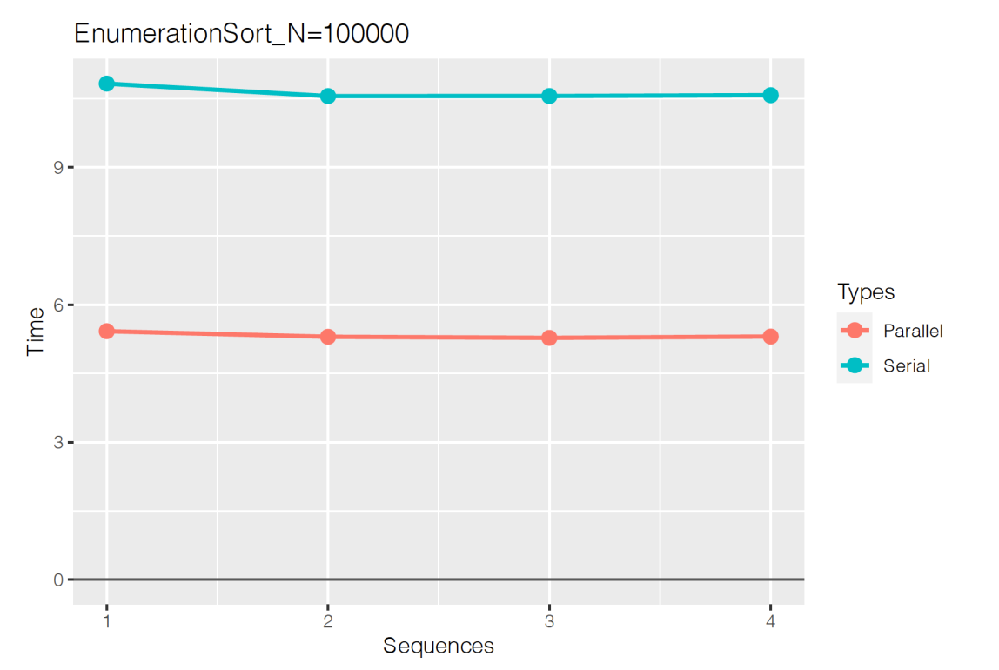
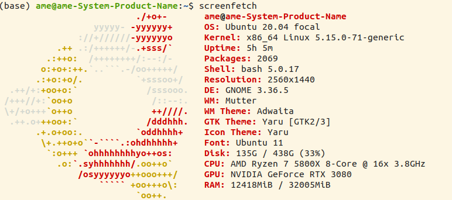

# Sorting Algorithm Optimization using **OpenMP** and **MPI**
[](https://www.rdi.uwa.edu.au/innovations-in-action)

This project aims to optimize classical sorting algorithms using OpenMP and MPI. The project contains two folders, one for OpenMP and the other for MPI.


## Aims

This project aims to design and develop serial and parallel solutions for three sorting algorithms: fast sort, enumeration sort, and merge sort using OpenMP and MPI to accelerate codes.
## Tasks

1. Random generation of an array with double-precision floating-point numbers.
2. A serial solution for each sorting algorithm that sorts the generated array.
3. A parallel solution for each sorting algorithm that sorts the array on the CPU using OpenMP or MPI.

## OpenMP


### Introduction
1. QuickSort

    Principle：The main principle of quick sorting is left and right exchange sorting, first, we
    determine a middle value, the array is divided into left and right two parts, from right to left
    to find smaller than the middle value, from left to right to find larger than the middle value,
    exchange each other's position, and so on, and so on, finally get a sequence that the
    middle value to the left is all smaller than the middle value, the middle value to the right is
    larger than the middle value. At this point, the left and right sides can be seen as two new
    arrays, continue to use the above principle until the end of the loop.

2. EnumerationSort

    Principle：Enumeration sorting is to compare the size of all elements with all other
    elements and find out how many elements are smaller than themselves, so as to
    obtain the position (rank) of the elements. The position of each element is unique.

3. MergeSort

    Principle: The array is split into individual elements, so that relative to itself is
    ordered, two adjacent elements compare size, so that the loop, and finally merged
    into a whole orderly sequence.

### Requirement
1. Random generation of an array with double-precision
    floating-point numbers:
    
    ```cpp
    std::random_device rd;
    std::mt19937 gen(rd());
    std::uniform_real_distribution<double> random(1.0, 100000.0);
    
    for (int i = 0; i < n; i++) {
        a[i] = random(gen);
        // std::cout << a[i] << ", ";
    }
    ```
    All of my code uses the same random function as shown in the
    figure to display double random numbers.
    
    ```
    liuyu@Ames-MacBookPro 5507 % ./a.out
    3.14555 1.57566 2.67936 4.57623 3.99636 2.41742 8.83001 727.742 3.27268 7.91091
    ```
2. A serial solution for each sorting algorithm to sort the generated array:

    [1] QuickSort
    
    ```
    Liuyu @ Ames-macbookpro 5507 g++-11 -openmp Quicksortopenmp2.cpp
    Liuyu @ Ames-macbookpro 5507 % ./a.out
    1.54195 3.08108 3.4174 4.60761 5.46417 7.97852 8.76398 8.84981 9.66999 9.84632
    ```

    [2] EnumerationSort
    
    

    [3] MergeSort
    
    


3. A parallel solution for each sorting algorithm to sort the array with OpenMP on
CPU;

    The parallel solution for each arrangement algorithm will be described in detail in the
    Report section.

### OpenMP Codes Algorithm
1. The C++ codes of your serial and parallel solutions.
    
    [1] QuickSort
    
    serial codes:
    ```cpp
    // QuickSort function to sort an array in ascending order
    void QuickSort(double *arr, int low, int high) {
        // Get the base value from the array
        double temp = arr[low];
    
        // Initialize two pointers, i and j, to traverse the array from both ends
        int i = low;
        int j = high;
    
        // While i and j haven't crossed and the current element is greater than the base value, move j left
        while (i < j && arr[j] > temp) {
            j--;
        }
        // When the current element is less than or equal to the base value, fill it in at i and move i right
        if (i < j) {
            arr[i] = arr[j];
            i++;
        }
    
        // While i and j haven't crossed and the current element is less than or equal to the base value, move i right
        while (i < j && arr[i] <= temp) {
            i++;
        }
        // When the current element is greater than the base value, fill it in at j and move j left
        if (i < j) {
            arr[j] = arr[i];
            j--;
        }
    
        // After i and j have crossed, fill in the base value at the correct position in the array
        arr[i] = temp;
    
        // Recursively sort the subarrays on the left and right of the base value
        if (low < i - 1) {
            QuickSort(arr, low, i - 1);
        }
        if (i + 1 < high) {
            QuickSort(arr, i + 1, high);
        }
    }
    ```
    parallel codes:
    
    My parallel idea is to divide the original array into two and sort them quickly respectively. After the
    quick sorting, the merging sorting of the two arrays can make the algorithm with the lowest time
    complexity and the most efficient algorithm.
    
    ```cpp
    #pragma omp parallel sections
    {
        #pragma omp section
        MergeSort(d, 0, m-1); // perform MergeSort on the left array
        
        #pragma omp section
        MergeSort(e, 0, m-1); // perform MergeSort on the right array
    }
    
    int left = 0, right = 0, k = 0;
    while (left < m && right < m) // continue while neither array is finished
    {
        // compare the leftmost elements of the two arrays
        if (d[left] <= e[right])
        {
            b[k++] = d[left++]; // add the smaller element to the output array
        }
        else
        {
            b[k++] = e[right++]; // add the smaller element to the output array
        }
    }
    
    while (left < m) // if the left array is unfinished
    {
        b[k++] = d[left++]; // add the remaining elements to the output array
    }
    
    while (right < m) // if the right array is unfinished
    {
        b[k++] = e[right++]; // add the remaining elements to the output array
    }
    ```
    [2] EnumerationSort
    
    serial codes:
    ```cpp
    void enumSort(double *a, double *b, int n)
    {
        // Iterate over each element in the array
        for (int i = 0; i < n; i++)
        {
            int k = 0;
            
            // Compare element i with every other element in the array
            for (int j = 0; j < n; j++)
            {
                if (a[i] > a[j])
                    k++;
            }
            
            // Find the next available slot in array b
            while (b[k] != 0)
                k++;
            
            // Insert the element from array a into array b at position k
            b[k] = a[i];
        }
    }
    ```
    Create two arrays. Array **A** is the sequence to be sorted, and array **B** is used to store the sorted sequence.
    
    Two **for** loops are used to perform enumeration sorting. The external **for** loop (`i = 0... i++`) selects a value to compare with each number in the sequence. The purpose of this loop is to iterate through all values in array **A**.
    
    The purpose of the second **for** loop (`j = 0... j++`) is to select a value to compare with each number in the sequence, which is "each number". After executing the **for** loop twice, we can compare each number in the sequence with all the other numbers in the sequence.
    
    If `a[i] > a[j]`, then the `k++` operation is performed, which means to move the position of `a[i]` to the right. For example, if the leftmost number `a[0]` in the sequence is larger than the five numbers in the sequence, `k++` is executed five times.
    
    Starting with the first number `a[i]`, we compare it with all the numbers in the sequence. If `a[i]` is smaller than the numbers in the sequence, we put `a[i]` in the position of the corresponding array **B**. 
    
    The purpose of the **while** loop is to determine whether the position of array **B** has a value at this time. If it does, the old original value will be replaced by the new value. For example, `33325` may be arranged as `23 empty 5`. 
    
    Finally, `b[k] = a[i]` puts the compared number in the correct position in array **B**.
    
    ```cpp
    void paEnumSort(double *a, double *b, int n) 
    {
    #pragma omp parallel
        {
    #pragma omp for
            for (int i = 0; i < n; i++) 
            {
                int k = 0;
                for (int j = 0; j < n; j++) 
                {
                    if (a[i] > a[j])
                        k++;
                }
                while (b[k] != 0)
                    k++;
                b[k] = a[i];
            }
        }
    }
    ```
    [3] MergeSort
    
    serial codes:
    
    ```cpp
    void MergeSort(double arr[], int low, int high)
    {
        if (low >= high) { return; } // base case: stop if sequence length is 1
        
        int mid = low + (high - low) / 2; // get middle element
        
        MergeSort(arr, low, mid); // recursive call on left half
        MergeSort(arr, mid + 1, high); // recursive call on right half
        Merge(arr, low, mid, high); // merge the two halves
    }
    
    void Merge(double arr[], int low, int mid, int high)
    {
        int i = low, j = mid + 1, k = 0; // initialize indices for left and right subarrays and temp array
        double *temp = new double[high - low + 1]; // create temporary array to store merged ordered sequence
        
        while (i <= mid && j <= high) { // compare elements in both subarrays and place them in temp in order
            if (arr[i] <= arr[j]) {
                temp[k++] = arr[i++];
            } else {
                temp[k++] = arr[j++];
            }
        }
        
        while (i <= mid) { // copy remaining elements in left subarray to temp
            temp[k++] = arr[i++];
        }
        
        while (j <= high) { // copy remaining elements in right subarray to temp
            temp[k++] = arr[j++];
        }
        
        for (i = low, k = 0; i <= high; i++, k++) { // copy elements from temp back to original array
            arr[i] = temp[k];
        }
        
        delete[] temp; // free up memory
    }
    ```
    parallel codes:
    
    The parallel idea of merge sort is similar to that of quicksort. I choose to divide the
    array into two, and then run merge sort twice in parallel, and then sort and merge the
    two arrays after sorting.
    
    ```cpp
    #pragma omp parallel sections
    {
    #pragma omp section
        MergeSort(d, 0, m-1);
    #pragma omp section
        MergeSort(e, 0, m-1);
    }
    while (left < m && right < m) // When the left and right arrays are not finished.
    {
        if (d[left] <= e[right])
            b[k++] = d[left++]; // If the smaller value is in the left array, move the left pointer one unit to the right.
        else
            b[k++] = e[right++]; // If the smaller value is in the right array, move the right pointer one unit to the right.
    }
    while (left < m)
        b[k++] = d[left++]; // Copy the remaining values from the left array to the merged array.
    while (right < m)
        b[k++] = e[right++]; // Copy the remaining values from the right array to the merged array.
    ```

### Experimental Data for OpenMP Codes
| Time    | Sort              | Types     | Sequences | Rating     |
|---------|-------------------|-----------|-----------|------------|
| 0.0155  | QuickSort         | Serial    | 1         | 1.8452381  |
| 0.0159  | QuickSort         | Serial    | 2         | 1.82758621 |
| 0.0162  | QuickSort         | Serial    | 3         | 1.90588235 |
| 0.0157  | QuickSort         | Serial    | 4         | 1.8045977  |
| 0.0158  | QuickSort         | Serial    | 5         | 1.8372093  |
| 0.0084  | QuickSort         | Parallel  | 1         |            |
| 0.0087  | QuickSort         | Parallel  | 2         |            |
| 0.0085  | QuickSort         | Parallel  | 3         |            |
| 0.0087  | QuickSort         | Parallel  | 4         |            |
| 0.0086  | QuickSort         | Parallel  | 5         | 8.23889189 |
| 45.8    | EnumerationSort   | Serial    | 1         | 8.69720624 |
| 42.338  | EnumerationSort   | Serial    | 2         | 8.77505155 |
| 42.559  | EnumerationSort   | Serial    | 3         | 8.6644898  |
| 42.456  | EnumerationSort   | Serial    | 4         | 8.65991    |
| 42.3383 | EnumerationSort   | Serial    | 5         |            |
| 5.559   | EnumerationSort   | Parallel  | 1         |            |
| 4.868   | EnumerationSort   | Parallel  | 2         |            |
| 4.85    | EnumerationSort   | Parallel  | 3         |            |
| 4.9     | EnumerationSort   | Parallel  | 4         |            |
| 4.889   | EnumerationSort   | Parallel  | 5         |            |
| 0.0291  | MergeSort         | Serial    | 1         |            |
| 0.0344  | MergeSort         | Serial    | 2         |            |
| 0.034   | MergeSort         | Serial    | 3         |            |
| 0.0341  | MergeSort         | Serial    | 4         | 1.02352941 |
| 0.0344  | MergeSort         | Serial    | 5         | 1.97109827 |
| 0.015   | MergeSort         | Parallel  | 1         |            |
| 0.017   | MergeSort         | Parallel  | 2         |            |
| 0.0176  | MergeSort         | Parallel  | 3         |            |
| 0.0173  | MergeSort         | Parallel  | 4         |            |
| 0.0172  | MergeSort         | Parallel  | 5         |            |

### Conclusion
The improvement ratio of parallel quicksort and parallel mergesort is about
100%, doubling the speed; The parallel enumeration sort is improved by
about 750%. We find that concurrent programs greatly improve the
enumeration sort of serial programs; Finally, on the whole, quick sort is the
best sort;

## MPI

### Introduction to MPI
OpenMP and MPI are two means of parallel programming. The
comparison is as follows:
OpenMP: thread level; Shared storage.
MPI: process level; Distributed storage.
The last project optimized OpenMP for three serial sorting, and
this project optimized MPI.

#### MPI Function
1. `MPI_Init(int* argc, char*** argv)`

    This function initializes the MPI environment, creates MPI global or internal variables, and assigns a unique rank to each process.
    
    ```cpp
    #include <mpi.h>
    
    int main(int argc, char** argv) {
        MPI_Init(&argc, &argv);
        // ...
        MPI_Finalize();
        return 0;
    }
    ```
2. `MPI_Wtime()`

    This function returns the wall-clock time in seconds.
    ```cpp
    #include <mpi.h>
    #include <iostream>
    
    int main(int argc, char** argv) {
        MPI_Init(&argc, &argv);
        double start_time = MPI_Wtime();
        // ...
        double end_time = MPI_Wtime();
        std::cout << "Elapsed time: " << end_time - start_time << " seconds\n";
        MPI_Finalize();
        return 0;
    }
    ```
3. `MPI_Comm_size(MPI_Comm communicator, int* size)`

    This function returns the size of the communicator, i.e., the number of processes available in the communicator.
    
    ```cpp
    #include <mpi.h>
    #include <iostream>
    
    int main(int argc, char** argv) {
        MPI_Init(&argc, &argv);
        MPI_Comm comm = MPI_COMM_WORLD;
        int size;
        MPI_Comm_size(comm, &size);
        std::cout << "Number of processes: " << size << std::endl;
        MPI_Finalize();
        return 0;
    }
    ```
4. `MPI_Comm_rank(MPI_Comm communicator, int* rank)`

    This function returns the rank of the current process in the communicator, i.e., a unique number starting from 0 that specifies the corresponding process when sending or receiving information.
    
    ```cpp
    #include <mpi.h>
    #include <iostream>
    
    int main(int argc, char** argv) {
        MPI_Init(&argc, &argv);
        MPI_Comm comm = MPI_COMM_WORLD;
        int rank;
        MPI_Comm_rank(comm, &rank);
        std::cout << "Rank of this process: " << rank << std::endl;
        MPI_Finalize();
        return 0;
    }
    ```
5. `MPI_Send(void* data, int count, MPI_Datatype datatype, int destination, int tag, MPI_Comm communicator)`

    : This function sends `count` data of type `datatype` to the destination process with rank `destination`. The data tag is `tag` and the communicator is `communicator`.
    
    ```cpp
    #include <mpi.h>
    #include <iostream>
    
    int main(int argc, char** argv) {
        MPI_Init(&argc, &argv);
        MPI_Comm comm = MPI_COMM_WORLD;
        int data = 42;
        int dest = 1;
        int tag = 0;
        MPI_Send(&data, 1, MPI_INT, dest, tag, comm);
        MPI_Finalize();
        return 0;
    }
    ```
6. `MPI_Recv(void* data, int count, MPI_Datatype datatype, int source, int tag, MPI_Comm communicator, MPI_Status* status)`
    
    <br>This function receives data of type `datatype` with tag `tag` from the source process with rank `source`. The maximum length of the data is `count`, and the actually received data length and tag are saved in `status`. The rank of the source process and the communicator are also specified.
    ```cpp
    #include <mpi.h>
    #include <iostream>
    
    int main(int argc, char** argv) {
        MPI_Init(&argc, &argv);
        MPI_Comm comm = MPI_COMM_WORLD;
        int data
    
    ```
7. `MPI_Comm_rank`

    This code gets the rank of the current process in the communicator MPI_COMM_WORLD and saves it in the variable `rank`.
    ```cpp
    int rank;
    MPI_Comm_rank(MPI_COMM_WORLD, &rank);
    ```
8. `MPI_Send`

    This code sends `count` number of data of type `datatype` from the buffer pointed to by `&data` to the process with rank `destination` in the communicator `MPI_COMM_WORLD`. The message is tagged with `tag`.
    ```cpp
    MPI_Send(&data, count, datatype, destination, tag, MPI_COMM_WORLD);
    ```
9. `MPI_Recv`

    This code receives a message of up to `count` elements of type `datatype` from the process with rank `source` in the communicator `MPI_COMM_WORLD`. The message must have tag `tag`. The received data is stored in the buffer pointed to by `&data`. Information about the received message is stored in the `MPI_Status` object pointed to by `&status`.
    ```cpp
    MPI_Recv(&data, count, datatype, source, tag, MPI_COMM_WORLD, &status);
    ```
10. `MPI_Bcast`

    This code broadcasts a message from the process with rank `source_proc` to all other processes in the communicator `comm`. The message consists of `count` elements of type `datatype` stored in the buffer pointed to by `&data`.
    ```cpp
    MPI_Bcast(&data, count, datatype, source_proc, comm);
    ```
### MPI Codes Algorithm
#### Design idea
1. Sort Algorithms
The design principle for all three sorting algorithms is to first divide the unordered array into two equal parts, as it is optimized for dual-core CPU with dual-process design. Then sort the two processes with rank == 1 and rank == 0 respectively. Finally, send the ordered array with rank == 1 to rank == 0 and perform the final merge at rank 0.

2. Random Array Generator and Verification Program
The design principle for generating the random array program is to first save the generated random array in binary format to `unsorted_array.txt`. Then read and verify the random array, with rank 1 being responsible for this task. The data is then sent to rank 0, which is responsible for verifying that the randomly generated array is the same as the data in `unsorted_array.txt`.

3. Serial and Parallel Sorting Verification
The principle for verifying serial and parallel sorting is similar to that of the random array generator and verification program. First, save the two sorted data in binary format into a text file. Then call the verification program, which is similar to the random array verification program. If the output is "All things same", it proves that the two sorting results are the same.

4. Mixed Programming of MPI and OpenMP
First, the multi-processes of MPI are used for common execution, and OpenMP optimizes the for loop from the thread to realize mixed programming. All three sorts use this idea.
#### MPI Codes
1. Quick sort:
    ```cpp
    if(rank==1){
        QuickSort(b1,0,m-1);
        MPI_Send(b1,m,MPI_DOUBLE,0,0,MPI_COMM_WORLD);
    }
    else if(rank==0){
        MPI_Recv(b1,m,MPI_DOUBLE,1,0,MPI_COMM_WORLD,MPI_STATUS_IGNORE);
        QuickSort(b2,0,m-1);
    }
    // Initialize a counter k, left pointer, and right pointer.
    int k = 0, left = 0, right = 0;
    while(left<m && right<m)
    {
        // Compare the first element of the two arrays and put the smaller one into the result array.
        if(b1[left]<=b2[right])
            b[k++]=b1[left++];
        else
            b[k++]=b2[right++];
    }
    // If the left array has any remaining elements, append them to the result array.
    while(left<m)
        b[k++]=b1[left++];
    // If the right array has any remaining elements, append them to the result array.
    while(right<m)
        b[k++]=b2[right++];
    // The final array b[N] is the final QuickSort_MPI sorted array. 
    ```
    If the rank is 1, it performs **QuickSort** on the left half of the array and sends the sorted array to rank 0 using `MPI_Send()`.
    
    If the rank is 0, it receives the sorted array from rank 1 using `MPI_Recv()` and performs **QuickSort** on the right half of the array.
    
    The merged array is constructed by comparing the first element of the left and right subarrays and selecting the smaller one.
    
    If there are any remaining elements in the left or right subarray, they are appended to the result array.
    The final array `b[N]` is the sorted array after **QuickSort_MPI**.
2. Merge sort:
    ```cpp
    if (rank == 1) {
        MergeSort(b1, 0, m - 1);
        MPI_Send(b1, m, MPI_DOUBLE, 0, 0, MPI_COMM_WORLD);
    }
    else if (rank == 0) {
        MPI_Recv(b1, m, MPI_DOUBLE, 1, 0, MPI_COMM_WORLD, MPI_STATUS_IGNORE);
        MergeSort(b2, 0, m - 1);
    }
    
    // Merge the two sorted subarrays
    while (left < m && right < m) {
        if (b1[left] <= b2[right])
            b[k++] = b1[left++];
        else
            b[k++] = b2[right++];
    }
    
    // Copy any remaining elements from left or right subarray
    while (left < m)
        b[k++] = b1[left++];
    while (right < m)
        b[k++] = b2[right++];
    
    // The final array b[N] is the sorted array after MergeSort_MPI.
    ```
    The MergeSort_MPI algorithm is a parallel sorting algorithm that utilizes both MPI and MergeSort to efficiently sort a large dataset. The algorithm is divided into two main parts:
    
    1. **Parallel Sorting:** If the rank is 1, it sorts the left half of the array using MergeSort and sends the sorted array to rank 0 using `MPI_Send()`. If the rank is 0, it receives the sorted array from rank 1 using `MPI_Recv()` and sorts the right half of the array using MergeSort.
    
    2. **Merging:** The merged array is constructed by comparing the first element of the left and right subarrays and selecting the smaller one. If there are any remaining elements in the left or right subarray, they are appended to the result array. The final array b[N] is the sorted array after MergeSort_MPI.
    
    This algorithm is highly efficient for large datasets and takes advantage of both parallel processing and the efficient MergeSort algorithm. 

3. Enumeration sort
    ```cpp
    if (rank == 1) {
        // Sort the left half of the array using Enumeration Sort
        enumSort(b1, c1, m);
        // Send the sorted array to rank 0
        MPI_Send(c1, m + 1, MPI_DOUBLE, 0, 0, MPI_COMM_WORLD);
    }
    else if (rank == 0) {
        // Receive the sorted array from rank 1
        MPI_Recv(c1, m + 1, MPI_DOUBLE, 1, 0, MPI_COMM_WORLD, MPI_STATUS_IGNORE);
        // Sort the right half of the array using Enumeration Sort
        enumSort(b2, c2, m);
    }
    
    // Merge the two sorted arrays
    while (left < m && right < m) {
        if (c1[left] <= c2[right])
            b[k++] = c1[left++];
        else
            b[k++] = c2[right++];
    }
    while (left < m)
        b[k++] = c1[left++];
    while (right < m)
        b[k++] = c2[right++];
    
    // The final array b[N] is the sorted array after EnumerationSort_MPI 
    ```
    The code performs Enumeration Sort on the left half of the array if the rank is 1, and sends the sorted array to rank 0 using MPI_Send(). If the rank is 0, it receives the sorted array from rank 1 using MPI_Recv() and performs Enumeration Sort on the right half of the array.
    
    The merged array is constructed by comparing the first element of the left and right subarrays and selecting the smaller one. If there are any remaining elements in the left or right subarray, they are appended to the result array.
    
    The final array b[N] is the sorted array after `EnumerationSort_MPI`.

### MPI Experiment Data







| 10000   | Type      | Average Time | Acceleration ratio | Promotion rate |
| ------- | --------- | ------------| ------------------| -------------- |
| QuickSort | Serial   | 0.0011985   | 1.0626             | 6.26%          |
| QuickSort | Parallel | 0.0012735   | -                  | -              |
| EnumerationSort | Serial   | 0.21271175 | 1.524              | 52.40%         |
| EnumerationSort | Parallel | 0.13957278 | -                  | -              |
| MergeSort | Serial   | 0.001887    | 1.0728             | 7.28%          |
| MergeSort | Parallel | 0.001759    | -                  | -              |
| ------- | --------- | ------------| ------------------| -------------- |
| 100000  | Type      | Average Time | Acceleration ratio | Promotion rate |
| QuickSort | Serial   | 0.01341475  | 1.12528            | 12.53%         |
| QuickSort | Parallel | 0.01192125  | -                  | -              |
| EnumerationSort | Serial   | 10.626163  | 1.995              | 99.50%         |
| EnumerationSort | Parallel | 5.3267382  | -                  | -              |
| MergeSort | Serial   | 0.0194187   | 1.1023             | 10.23%         |
| MergeSort | Parallel | 0.0176165   | -                  | -              |

### Conclusion
From the final tables and charts we can find:
Quick_Sort the dual-core CPU improvement rate in MPI parallel
programs that process big data is more than 10%, and so on, the
multicore CPU improvement rate should be higher.
Enumeration_Sort the dual-core CPU improvement rate in MPI
parallel programs that process big data is close to 100%, and so
on the multicore CPU improvement rate should be higher.
Merge_Sort the two-core CPU boost rate in MPI parallel
programs that handle big data should be higher at 10% for life.

## Experimental Environment


