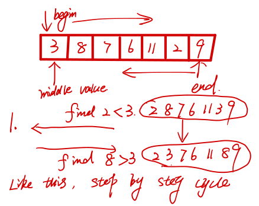
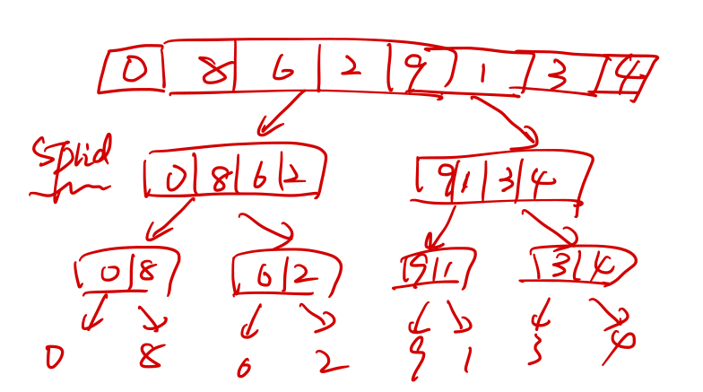

# Sorting Algorithm Optimization using **OpenMP** and **MPI**

This project aims to optimize classical sorting algorithms using OpenMP and MPI. The project contains two folders, one for OpenMP and the other for MPI.

## OpenMP

# Parallel Sorting on OpenMP

This project aims to design and develop serial and parallel solutions for three sorting algorithms: fast sort, enumeration sort, and merge sort using OpenMP. The submission deadline for the project is Friday, September 17, 2021, at 23:59 pm on cssubmit.

## Tasks

1. Random generation of an array with double-precision floating-point numbers.
2. A serial solution for each sorting algorithm that sorts the generated array.
3. A parallel solution for each sorting algorithm that sorts the array on the CPU using OpenMP.


## Structure
[1] QuickSort

Principle：The main principle of quick sorting is left and right exchange sorting, first, we
determine a middle value, the array is divided into left and right two parts, from right to left
to find smaller than the middle value, from left to right to find larger than the middle value,
exchange each other's position, and so on, and so on, finally get a sequence that the
middle value to the left is all smaller than the middle value, the middle value to the right is
larger than the middle value. At this point, the left and right sides can be seen as two new
arrays, continue to use the above principle until the end of the loop.

Diagram:



[2]EnumerationSort

Principle：Enumeration sorting is to compare the size of all elements with all other
elements and find out how many elements are smaller than themselves, so as to
obtain the position (rank) of the elements. The position of each element is unique.

Diagram:


[3]MergeSort

Principle: The array is split into individual elements, so that relative to itself is
ordered, two adjacent elements compare size, so that the loop, and finally merged
into a whole orderly sequence.

Diagram:



## Requirement
(1).Random generation of an array with double-precision
floating-point numbers:

```cpp
std::random_device rd;
std::mt19937 gen(rd());
std::uniform_real_distribution<double> random(1.0, 100000.0);

for (int i = 0; i < n; i++) {
    a[i] = random(gen);
    // std::cout << a[i] << ", ";
}
```


### Experimental Environment

The experimental environment should include details of the CPU, memory, and operating system used in the experiments.

### Compilation

The compilation process should be described in detail, including the compiler version and any compiler flags used.

### Experimental Results

The experimental results should include a wide range of array sizes, and the execution times of both the serial and parallel implementations should be recorded. The results should be presented in a clear and organized manner, such as in a table.

### Analysis

The analysis should include a discussion of the performance of the parallel solutions compared to the serial solutions. The analysis should include a discussion of the scalability of the parallel solutions and any limitations or bottlenecks encountered. Recommendations for future work can also be included.

## Conclusion

In conclusion, this project aims to optimize sorting algorithms using OpenMP. The report should include detailed descriptions of the implementation, experimental results, and analysis of the performance of the serial and parallel solutions.
## MPI

The MPI folder contains serial and parallel solutions for the same three sorting algorithms: **quick sort**, **enumeration sort**, and **merge sort** using MPI.

### Quick Sort

The MPI implementation of the quick sort algorithm distributes the data among multiple processors and parallelizes the partition and sort operations to improve performance.

### Enumeration Sort

The MPI implementation of the enumeration sort algorithm distributes the data among multiple processors and parallelizes the counting operation to improve performance.

### Merge Sort

The MPI implementation of the merge sort algorithm distributes the data among multiple processors and parallelizes the merge operation to improve performance.

## Experimental Data

Each folder contains specific files that include detailed requirements and experimental data for each sorting algorithm.

## Report

The `Report.md` file in each folder contains the details of all projects, including a description of the algorithms, the implementation details, and the experimental results.
